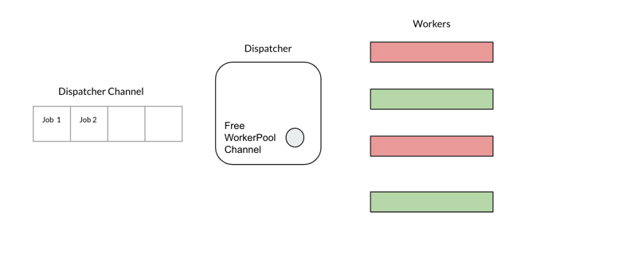

# Worker Pool

[](https://goreportcard.com/report/github.com/arjunsk/workerpool)

> This library is a fork of Dirk Pahl's [kyoo](https://github.com/dirkaholic/kyoo). 
> I have added more comments and refactored a little for better understandability.

This is a `job queue` + `worker pool` implementation.




## Install

```sh
$ go get github.com/arjunsk/workerpool
```


## Usage

```go
package main

import (
	"fmt"
	"github.com/arjunsk/workerpool"
)

func main() {
	wp := workerpool.NewWorkerPool(2)
	wp.Start()

	for i := int32(0); i < 10; i++ {
		val := i // create a copy of i
		err := wp.Submit(func() {
			fmt.Printf(" %v ", val)
		})

		if err != nil {
			panic(err)
		}
	}
	wp.Stop()
}

// Output:
// 0  2  3  4  5  6  7  8  9  1
```

